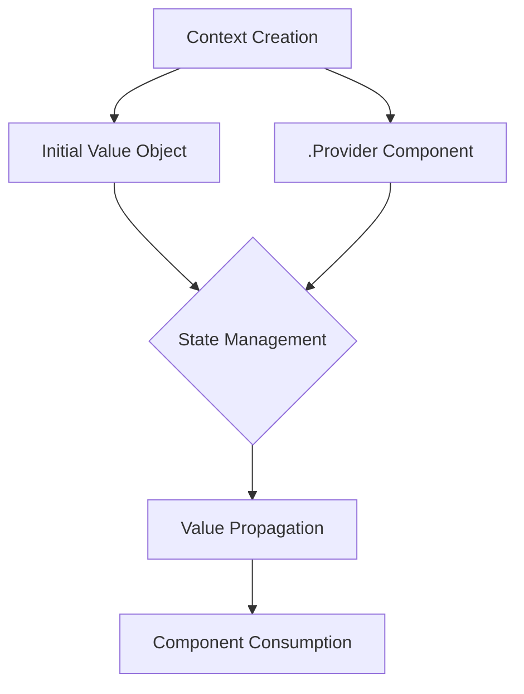

# 🔍 React Context: Deep Dive into State Management

## 📂 Project Structure Insights

### Recommended Folder Organization
- **`/src/store/`**: Dedicated context and state management directory
  - > 💡 *Naming Convention*: Uppercase-first file names signal React component/context files

## 🏗 Context Creation Mechanics

### `createContext()` Fundamental Breakdown

```jsx
import { createContext } from "react";

export const CartContext = createContext({
  items: []  // 🔑 Initial state prototype
});
```

#### ✨ Key Characteristics
- **Flexible Initial Value**: Can be any type (object, array, primitive)
- **Prototype Significance**: Provides type hinting and default structure
- **No Direct State Management**: Just creates a communication channel

### 🔬 Nuanced Object Anatomy

| Component | Purpose | Characteristics |
|-----------|---------|-----------------|
| `CartContext` | Context Object | Contains `.Provider`, initial value |
| `CartContext.Provider` | Wrapper Component | Enables value propagation |
| Initial Value Object | State Prototype | Defines expected structure |

## 🌐 Context Propagation Strategies

### React 19+ Approach
```jsx
<CartContext>  // 🆕 Modern, component-like syntax
  {/* Child components */}
</CartContext>
```

### Pre-React 19 Methodology
```jsx
<CartContext.Provider>  // 📡 Explicit provider usage
  {/* Child components */}
</CartContext.Provider>
```

## 🚨 Critical Distinctions

### Provider vs Initial Value

> **❗ Crucial Insight**: `.Provider` is a *distinct entity* from the initial context value

#### Comparison Matrix

| Aspect | Initial Value | `.Provider` |
|--------|---------------|-------------|
| **Type** | Plain Object | React Component |
| **Purpose** | Structural Hint | State Distribution |
| **Created By** | Developer | `createContext()` |

### 🔄 Contextual Inheritance
- Nested components can access context values
- Provides alternative to prop drilling
- Performance considerations exist

## 🛠 Advanced Usage Patterns

### Dynamic Context Updates
- Use `useState()` with context
- Create custom provider components
- Implement reducer patterns for complex state

## 🧠 Mental Model



## 🚀 Best Practices

- ✅ Use for genuinely shared state
- ✅ Keep contexts focused
- ❌ Avoid overusing for simple prop passing
- ❌ Don't treat as global state management solution

## 💡 Performance Considerations
- Context updates trigger re-renders
- Memoization techniques recommended
- Split contexts for granular updates

## 🔍 Debugging Strategies
- React DevTools Context tab
- Verify initial value structure
- Use TypeScript for enhanced type safety

> **🎯 Key Takeaway**: Context is a powerful, nuanced tool requiring thoughtful implementation